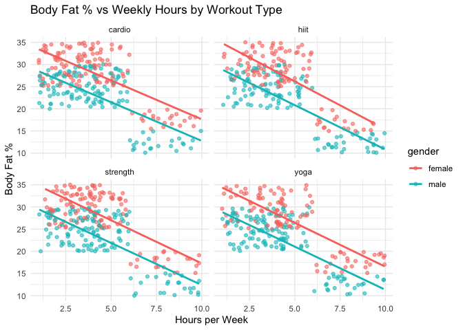
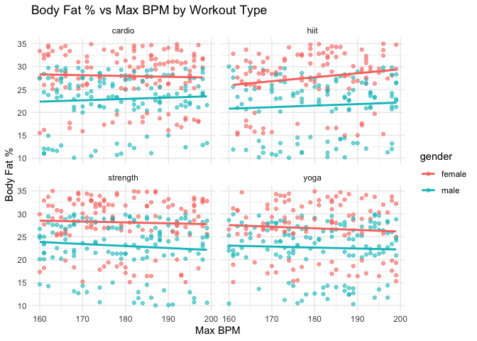
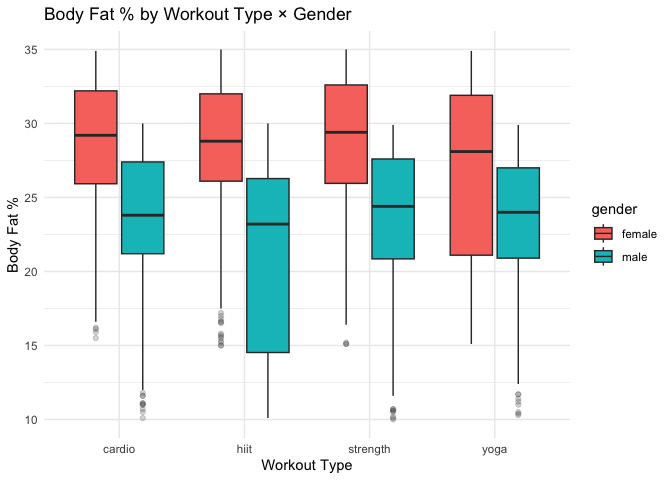

Coursera Data Analyst Capstone
================
Nicholas A. Jojola
2025-09-10

### Introduction

In this theoretical setting I will be acting as a data analyst for a
fitness company looking to improve their recommendations for new members
based on their fitness goals.

### Clean

In data cleaning we started with data uniformity, converting column
names and character data points into lowercase as well as trimming any
unnecessary values e.g. hidden spaces.

Next, we re-coded the gender column to ensure all factors were either
male or female, converting possible data points “m” to male, and “f” to
female.

We then converted the age column to integers in the case that
information was entered into as a type that may not be recognized later
in our exploration.

Finally, we filtered age to only include the age range of 10-100, and
weight to only include 60-600 lbs. as anything outside of these would
most likely be a mistakes or outliers and of course dropped any
duplicate
entries.

<table class="table table-striped table-hover table-condensed" style="width: auto !important; margin-left: auto; margin-right: auto;">

<caption>

QC: Missingness and Uniqueness by Column

</caption>

<thead>

<tr>

<th style="text-align:left;">

column

</th>

<th style="text-align:right;">

n\_na

</th>

<th style="text-align:right;">

n\_unique

</th>

</tr>

</thead>

<tbody>

<tr>

<td style="text-align:left;">

age

</td>

<td style="text-align:right;">

0

</td>

<td style="text-align:right;">

42

</td>

</tr>

<tr>

<td style="text-align:left;">

gender

</td>

<td style="text-align:right;">

0

</td>

<td style="text-align:right;">

2

</td>

</tr>

<tr>

<td style="text-align:left;">

weight\_kg

</td>

<td style="text-align:right;">

0

</td>

<td style="text-align:right;">

532

</td>

</tr>

<tr>

<td style="text-align:left;">

height\_m

</td>

<td style="text-align:right;">

0

</td>

<td style="text-align:right;">

51

</td>

</tr>

<tr>

<td style="text-align:left;">

max\_bpm

</td>

<td style="text-align:right;">

0

</td>

<td style="text-align:right;">

40

</td>

</tr>

<tr>

<td style="text-align:left;">

avg\_bpm

</td>

<td style="text-align:right;">

0

</td>

<td style="text-align:right;">

50

</td>

</tr>

<tr>

<td style="text-align:left;">

resting\_bpm

</td>

<td style="text-align:right;">

0

</td>

<td style="text-align:right;">

25

</td>

</tr>

<tr>

<td style="text-align:left;">

session\_duration\_hours

</td>

<td style="text-align:right;">

0

</td>

<td style="text-align:right;">

147

</td>

</tr>

<tr>

<td style="text-align:left;">

calories\_burned

</td>

<td style="text-align:right;">

0

</td>

<td style="text-align:right;">

621

</td>

</tr>

<tr>

<td style="text-align:left;">

workout\_type

</td>

<td style="text-align:right;">

0

</td>

<td style="text-align:right;">

4

</td>

</tr>

<tr>

<td style="text-align:left;">

fat\_percentage

</td>

<td style="text-align:right;">

0

</td>

<td style="text-align:right;">

239

</td>

</tr>

<tr>

<td style="text-align:left;">

water\_intake\_liters

</td>

<td style="text-align:right;">

0

</td>

<td style="text-align:right;">

23

</td>

</tr>

<tr>

<td style="text-align:left;">

workout\_frequency\_days\_week

</td>

<td style="text-align:right;">

0

</td>

<td style="text-align:right;">

4

</td>

</tr>

<tr>

<td style="text-align:left;">

experience\_level

</td>

<td style="text-align:right;">

0

</td>

<td style="text-align:right;">

3

</td>

</tr>

<tr>

<td style="text-align:left;">

bmi

</td>

<td style="text-align:right;">

0

</td>

<td style="text-align:right;">

771

</td>

</tr>

<tr>

<td style="text-align:left;">

weight\_lb

</td>

<td style="text-align:right;">

0

</td>

<td style="text-align:right;">

532

</td>

</tr>

<tr>

<td style="text-align:left;">

hours\_per\_week

</td>

<td style="text-align:right;">

0

</td>

<td style="text-align:right;">

297

</td>

</tr>

</tbody>

</table>

### Explore

In this section, we will investigate the relationships between
demographic and behavioral factors—such as gender, workout type, and
weekly exercise duration—and key health outcomes including body fat
percentage, estimated cardiovascular fitness. Our goal is to identify
meaningful patterns that may inform recommendations for new gym members
based on their fitness goals.

### Body Fat and Workout Type

As you can see from the scatter plots there is a clear and distinct
negative correlation between body fat percentage and hours per week
spent in the gym.

HITT and cardio show the strongest negative correlation between hours of
exercise per week and body fat. Strength and yoga show a strong negative
correlation as well, however not as profound.

There doesn’t seem to be any significant correlation between body fat
percentage and max BPM.

There is a clear difference in body fat between men and women as
expected due to biological differences between the two group; women on
average having naturally higher body fat
percentages.

<table class="table table-striped table-hover table-condensed" style="width: auto !important; margin-left: auto; margin-right: auto;">

<caption>

Summary by Gender × Workout
Type

</caption>

<thead>

<tr>

<th style="text-align:left;">

gender

</th>

<th style="text-align:left;">

workout\_type

</th>

<th style="text-align:right;">

n

</th>

<th style="text-align:right;">

hours\_median

</th>

<th style="text-align:right;">

hours\_IQR

</th>

<th style="text-align:right;">

bpm\_median

</th>

<th style="text-align:right;">

fat\_median

</th>

<th style="text-align:right;">

fat\_IQR

</th>

</tr>

</thead>

<tbody>

<tr>

<td style="text-align:left;">

female

</td>

<td style="text-align:left;">

cardio

</td>

<td style="text-align:right;">

126

</td>

<td style="text-align:right;">

3.84

</td>

<td style="text-align:right;">

2.6325

</td>

<td style="text-align:right;">

182

</td>

<td style="text-align:right;">

29.2

</td>

<td style="text-align:right;">

6.275

</td>

</tr>

<tr>

<td style="text-align:left;">

female

</td>

<td style="text-align:left;">

hiit

</td>

<td style="text-align:right;">

107

</td>

<td style="text-align:right;">

4.14

</td>

<td style="text-align:right;">

2.4900

</td>

<td style="text-align:right;">

179

</td>

<td style="text-align:right;">

28.8

</td>

<td style="text-align:right;">

5.900

</td>

</tr>

<tr>

<td style="text-align:left;">

female

</td>

<td style="text-align:left;">

strength

</td>

<td style="text-align:right;">

123

</td>

<td style="text-align:right;">

4.00

</td>

<td style="text-align:right;">

2.6500

</td>

<td style="text-align:right;">

177

</td>

<td style="text-align:right;">

29.4

</td>

<td style="text-align:right;">

6.650

</td>

</tr>

<tr>

<td style="text-align:left;">

female

</td>

<td style="text-align:left;">

yoga

</td>

<td style="text-align:right;">

106

</td>

<td style="text-align:right;">

4.26

</td>

<td style="text-align:right;">

3.0500

</td>

<td style="text-align:right;">

180

</td>

<td style="text-align:right;">

28.1

</td>

<td style="text-align:right;">

10.800

</td>

</tr>

<tr>

<td style="text-align:left;">

male

</td>

<td style="text-align:left;">

cardio

</td>

<td style="text-align:right;">

129

</td>

<td style="text-align:right;">

3.99

</td>

<td style="text-align:right;">

2.7400

</td>

<td style="text-align:right;">

178

</td>

<td style="text-align:right;">

23.8

</td>

<td style="text-align:right;">

6.200

</td>

</tr>

<tr>

<td style="text-align:left;">

male

</td>

<td style="text-align:left;">

hiit

</td>

<td style="text-align:right;">

114

</td>

<td style="text-align:right;">

4.11

</td>

<td style="text-align:right;">

3.5250

</td>

<td style="text-align:right;">

183

</td>

<td style="text-align:right;">

23.2

</td>

<td style="text-align:right;">

11.750

</td>

</tr>

<tr>

<td style="text-align:left;">

male

</td>

<td style="text-align:left;">

strength

</td>

<td style="text-align:right;">

135

</td>

<td style="text-align:right;">

4.04

</td>

<td style="text-align:right;">

2.5350

</td>

<td style="text-align:right;">

180

</td>

<td style="text-align:right;">

24.4

</td>

<td style="text-align:right;">

6.750

</td>

</tr>

<tr>

<td style="text-align:left;">

male

</td>

<td style="text-align:left;">

yoga

</td>

<td style="text-align:right;">

133

</td>

<td style="text-align:right;">

3.84

</td>

<td style="text-align:right;">

2.7600

</td>

<td style="text-align:right;">

182

</td>

<td style="text-align:right;">

24.0

</td>

<td style="text-align:right;">

6.100

</td>

</tr>

</tbody>

</table>

<!-- --><!-- -->

### Box Plots

In the box plots we can see that the median body fat percentage across
all workout types are insignificant; however, HITT has a much wider
spread indicating that there is a larger variability among this group,
further exploration is needed to see if this spread is due to other
factors. <!-- -->

### Regression

In the regression coefficient table below we can see that holding the
workout type variables constant, gym goings can expect an estimated 1.9%
decrease in body fat per hour they spend in the gym each week with no
statistical significance between
groups.

<table class="table" style="width: auto !important; margin-left: auto; margin-right: auto;">

<caption>

Regression Coefficients: Fat % Model

</caption>

<thead>

<tr>

<th style="text-align:left;">

term

</th>

<th style="text-align:right;">

estimate

</th>

<th style="text-align:right;">

std.error

</th>

<th style="text-align:right;">

statistic

</th>

<th style="text-align:right;">

p.value

</th>

<th style="text-align:right;">

conf.low

</th>

<th style="text-align:right;">

conf.high

</th>

</tr>

</thead>

<tbody>

<tr>

<td style="text-align:left;">

Intercept

</td>

<td style="text-align:right;">

36.132

</td>

<td style="text-align:right;">

1.985

</td>

<td style="text-align:right;">

18.203

</td>

<td style="text-align:right;">

0.000

</td>

<td style="text-align:right;">

32.237

</td>

<td style="text-align:right;">

40.027

</td>

</tr>

<tr>

<td style="text-align:left;">

Male (vs Female)

</td>

<td style="text-align:right;">

\-5.212

</td>

<td style="text-align:right;">

0.250

</td>

<td style="text-align:right;">

\-20.825

</td>

<td style="text-align:right;">

0.000

</td>

<td style="text-align:right;">

\-5.704

</td>

<td style="text-align:right;">

\-4.721

</td>

</tr>

<tr>

<td style="text-align:left;">

HIIT (vs baseline)

</td>

<td style="text-align:right;">

\-0.216

</td>

<td style="text-align:right;">

0.359

</td>

<td style="text-align:right;">

\-0.602

</td>

<td style="text-align:right;">

0.547

</td>

<td style="text-align:right;">

\-0.920

</td>

<td style="text-align:right;">

0.488

</td>

</tr>

<tr>

<td style="text-align:left;">

Strength (vs baseline)

</td>

<td style="text-align:right;">

0.625

</td>

<td style="text-align:right;">

0.344

</td>

<td style="text-align:right;">

1.814

</td>

<td style="text-align:right;">

0.070

</td>

<td style="text-align:right;">

\-0.051

</td>

<td style="text-align:right;">

1.301

</td>

</tr>

<tr>

<td style="text-align:left;">

Yoga (vs baseline)

</td>

<td style="text-align:right;">

\-0.069

</td>

<td style="text-align:right;">

0.351

</td>

<td style="text-align:right;">

\-0.197

</td>

<td style="text-align:right;">

0.844

</td>

<td style="text-align:right;">

\-0.759

</td>

<td style="text-align:right;">

0.621

</td>

</tr>

<tr>

<td style="text-align:left;">

Hours per week

</td>

<td style="text-align:right;">

\-1.921

</td>

<td style="text-align:right;">

0.058

</td>

<td style="text-align:right;">

\-33.398

</td>

<td style="text-align:right;">

0.000

</td>

<td style="text-align:right;">

\-2.034

</td>

<td style="text-align:right;">

\-1.808

</td>

</tr>

<tr>

<td style="text-align:left;">

Max
BPM

</td>

<td style="text-align:right;">

\-0.001

</td>

<td style="text-align:right;">

0.011

</td>

<td style="text-align:right;">

\-0.059

</td>

<td style="text-align:right;">

0.953

</td>

<td style="text-align:right;">

\-0.022

</td>

<td style="text-align:right;">

0.021

</td>

</tr>

</tbody>

</table>

<table class="table" style="width: auto !important; margin-left: auto; margin-right: auto;">

<caption>

Model Fit: Fat % Model

</caption>

<thead>

<tr>

<th style="text-align:right;">

r.squared

</th>

<th style="text-align:right;">

adj.r.squared

</th>

<th style="text-align:right;">

sigma

</th>

<th style="text-align:right;">

df

</th>

<th style="text-align:right;">

p.value

</th>

<th style="text-align:right;">

AIC

</th>

<th style="text-align:right;">

BIC

</th>

</tr>

</thead>

<tbody>

<tr>

<td style="text-align:right;">

0.615

</td>

<td style="text-align:right;">

0.613

</td>

<td style="text-align:right;">

3.895

</td>

<td style="text-align:right;">

6

</td>

<td style="text-align:right;">

0

</td>

<td style="text-align:right;">

5416.406

</td>

<td style="text-align:right;">

5455.449

</td>

</tr>

</tbody>

</table>

### Interpret

From our analysis we can confidently say that body fat percentage is
highly correlated with hours spent per week exercising regardless of
workout type with the most variation in HITT workouts

We were unable to find any significant correlation between workout types
and cardiovascular health although our data being limited to a single
point in time.

### Communicate

Based on our findings we can conclude that hours per week and body fat
percentage are strongly correlated. This can give an initial
recommendation for spending more time exercising and allow new gym
members what to expect from exercise in general.

To discover fat loss and cardiovascular health we will need too collect
more data to give our clients better recommendations.

### Act

Our next steps would be to train implement programs for new gym members
looking to lose body fat to spend more time exercising.

Suggestions would be meeting with personal trainers and sign up for
classes such as HITT and yoga that keep new gym members structure and
accountability.

Lastly. we will want to collect more data and continue our analysis to
give more new gym members for advanced recommendations.
